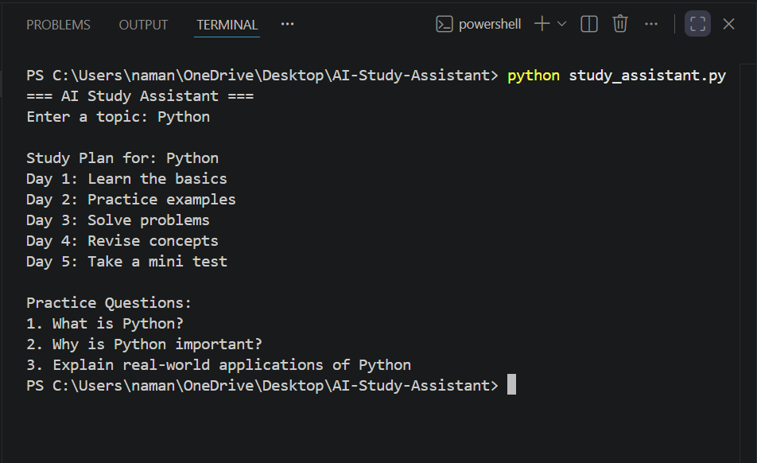

# AI Study Assistant

A simple Python project that generates a 5-day study plan and practice questions for any topic.

## Features
- User input
- Study plan generation
- Practice questions
- Beginner friendly

## Technologies Used
- Python

## Author
Naman Pradhan
## Sample Output

